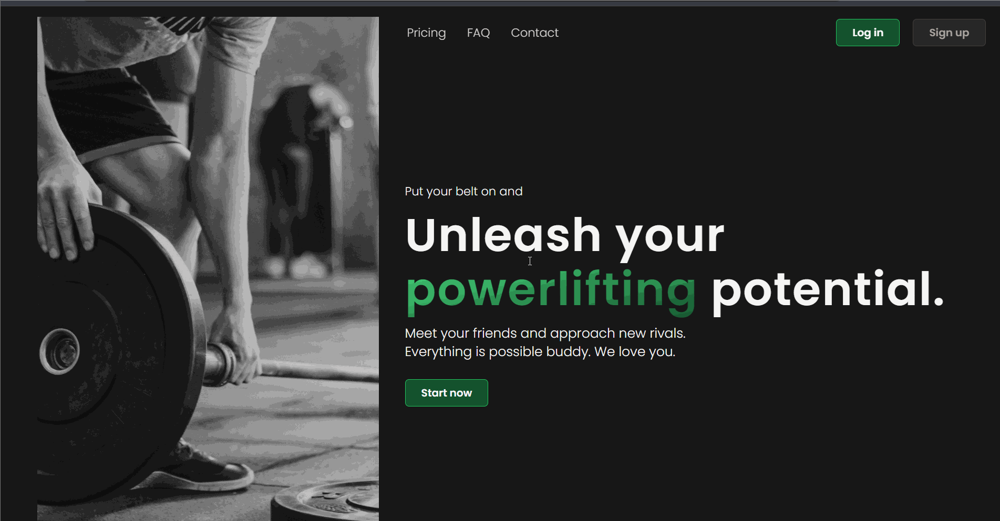

<p align="center">
  
</p>

# Power Space - React project
Power Space is a social platform for powerlifters, through which we can update our strength results. All application users are scored and placed next to each other in the ranking. Additionally, we can publish posts with photos on the wall and add other users to the friends list. I created this project to learn how to work using React and other libraries necessary for creating efficient, maintainable code of high quality.

# [Live DEMO](https://power-space.vercel.app)


<br>
<br>

## Tech stack
The application was developed by using these tools:
- React,
- Vite,
- TailwindCSS,
- Tanstack Query,
- React-Hook-Form,
- React Hot Toast,
- Vitest,
- Testing Library,
- Supabase
  <br>
  
## Getting Started

Follow these steps to install power-space on your local environment.
<br>
<strong>Clone projects repository</strong>
```
git clone https://github.com/KamilTomczykDev/power-space.git
```
<strong>Install the packages</strong>
```
npm install
```

<strong>Run the app using terminal</strong>
```
npm run dev
```
<br>

# Requirements

## General:
- Build a real world application from the scratch.
- Use best practices to provide good performance, scalability and readability of the project.
- Create responsive UI.

## Homepage:
- Print neccessary informations about the product such as pros of using the app, pricing, contact form etc.
- Allow user to smooth scroll through the page by using the navigation bar on the top of the screen.
- Create call to action buttons to navigate to log in or sign up page.<br>

## Authentication:

- Users of the app are people intrested in lifting weights, allow them to create an account or log in to an existing one.<br>
- Keep the session alive until user loggs out or clears cache memory.

## Wall:
- App needs a view on newest posts added by the community.
- Allow users to zoom in the images.
- Allow users to add their own posts with an option of uploading images.
- Users may want to edit their post or even delete it from the app.
- Display a descriptive icon if author of a posts is in a friends list of the currently logged in user.
- Instead of showing full content of a post, display only a piece of it with "show more" button at the end.<br>

## Dashboard:
- App needs a view on the currenly logged in user and his statistics such as lifting stats, age, height etc.
- Display an etiquette of an user with a color reffering to users score.
- Allow user to update his statistics and training parameters.<br>

## Ranking/Profiles:
- Create a table of users currently registered in the application.
- Allow users to filter through profiles by age. (juniors/seniors)
- Allow users to sort the table by score, total and weight.
- Create pagination or infinite loading to display only readable amount of profiles.
- Show adequate medal for top 3 lifters in each category.
- Display profile of each user of the app.<br>
 

 ## Friends:
- Users can add each other to friends list via button on the profile page.
- Display a list of profiles that user added to his friends list.
- In each of them user has to find a button to navigate to that profiles details.<br>
  
## Account:
- Allow users to change account data such as username and password.<br>
  
## Settings:
- Some users may want to use pounds instead of kilograms, allow them to change the unit.
- Create an option to hide a profile in a ranking leaderboard.<br>
<br>

# Implementation

## Back-end
As a person currently focused on front-end development, I decided to build my own back-end with Supabase. Using a pre-existing (in my opinion, overused) weather API or crypto API was out of the question, as from the beginning, I wanted to create a product tailored to my needs. Supabase offers intuitive GUI to create a database and provides access to an extensive API. Learning back-end development to bring the project to completion would certainly have taken at least a few months, and that was not an option for me in this case.

## Problems

### Authentication:
- Authentication is present in our daily lives and forms the basis of current internet services and websites. I wanted to implement such functionality, and Supabase API helped me with this. It saves an active session in the <code>localStorage</code> (only if the user has entered correct login credentials), thus providing access to the application secured within protected route. <br>

```

function ProtectedRoute({ children }) {
  const navigate = useNavigate();
  const { isLoading, isAuthenticated } = useUser();

  useEffect(
    function () {
      if (!isAuthenticated && !isLoading) navigate("/login");
    },
    [isAuthenticated, isLoading, navigate],
  );

  if (isLoading)
    return (
      <div className="flex h-screen w-full items-center justify-center">
        
      </div>
    );

  if (isAuthenticated) return children;
}

export default ProtectedRoute;
```

### Adding friends:
- I was not sure for a long time if my idea would work because it emerged before I wrote the first lines of code in this project, and I didn't know if Supabase would allow me to use an array in one of the columns. The concept was as follows: since when visiting a specific profile on our platform, we receive the <code>id</code> of the user in the URL address, we can retrieve it and check if the value equal to this <code>id</code> from the URL address is present in the array in the friends column of the currently logged-in user's profile. If it is present in our array, then upon pressing the appropriate button (which would then be labeled "Remove friend"), we filter out that value from the array. Otherwise, the button is labeled "Add Friend," and we destructure the array retrieved from the API, add another element to it whose value is the <code>id</code> from the URL address, and then save this array in our database.<br>
  
```
function AddFriendButton({ friends, currentProfileId, id }) {
  const { updateProfile, isUpdating } = useUpdateProfile();

  const isFriend = friends.includes(id);

  const handleAddFriend = () => {
    const updatedFriends = [...friends, id];
    updateProfile({ stats: { friends: updatedFriends }, id: currentProfileId });
  };

  const handleRemoveFriend = () => {
    const updatedFriends = friends.filter((friendId) => friendId !== id);
    updateProfile({ stats: { friends: updatedFriends }, id: currentProfileId });
  };

  const handleClick = () => {
    if (isFriend) {
      handleRemoveFriend();
    } else {
      handleAddFriend();
    }
  };

  return (
    <Button onClick={handleClick} disabled={isUpdating}>
      {isUpdating ? <SpinnerMini /> : isFriend ? "Remove friend" : "Add friend"}
    </Button>
  );
}
```

### Adding posts:
- To create a post, you simply need to fill out the text area and optionally add a file with a photo. Then, you submit the form, and the post is added to our database. The concept seems simple, but in practice, it caused me a lot of difficulties. I struggled with where this "optionality" should reside. Ultimately, I opted for an if statement that determined whether the asynchronous function insertPost() would add an image to the storage bucket along with a specially generated name. When we could receive an optional null value, the component responsible for displaying posts on the screen conditionally rendered the image if it was a truthy value.<br>

```
  if (!newPost.image) {
    let { data, error } = await supabase
      .from("posts")
      .insert([{ ...newPost, image: null }])
      .select();

    if (error) {
      console.error(error);
      throw new Error(error.message);
    }

    return data;
  }
```

## Testing

When it comes to testing the application, I decided to use <code>Vitest</code> and <code>Testing Library</code>. I focused on testing key components from the user's perspective, mainly ensuring their correct rendering, as well as several important hooks. I regret not starting to write tests sooner because I believe it could have brought a lot of value to the project and allowed me to gain a broader perspective on software development more quickly.

## CI/CD

I utilized the above mentioned tests to set up a simple workflow using GitHub Actions and Vercel:

- With each pull request, the code that introduces changes to the project is tested.
- Subsequently, if the tests pass successfully, a new build is created.
- Finally, the build is deployed using Vercel, and the application is ready for production use in a matter of seconds.
- 
```
name: Node Continuous Integration and Vercel Deployment
env:
  VERCEL_ORG_ID: ${{ secrets.VERCEL_ORG_ID }}
  VERCEL_PROJECT_ID: ${{ secrets.VERCEL_PROJECT_ID }}
on:
  pull_request:
    branches: [main]

jobs:
  test_pull_request:
    runs-on: ubuntu-latest
    steps:
      - uses: actions/checkout@v2
      - uses: actions/setup-node@v1
        with:
          node-version: 18
      - name: Install
        run: npm ci
      - name: Test
        run: npm run test
      - name: Install Vercel CLI
        run: npm install --global vercel@latest
      - name: Pull Vercel Environment Information
        run: vercel pull --yes --environment=production --token=${{ secrets.VERCEL_TOKEN }}
      - name: Build Project Artifacts
        run: vercel build --prod --token=${{ secrets.VERCEL_TOKEN }}
      - name: Deploy Project Artifacts to Vercel
        run: vercel deploy --prebuilt --prod --token=${{ secrets.VERCEL_TOKEN }}
```

# Upcoming features:

### Live chat:
Huge part of every social media platform is a communication. That's why my next move is to build responsive and fast live chat.

# Contact

## [LinkedIn](https://www.linkedin.com/in/kamil-tomczyk-a118952b3/)
I'm currently spending a lot of time on that platform. Feel free to ask any questions about my projects or about anything else :)

