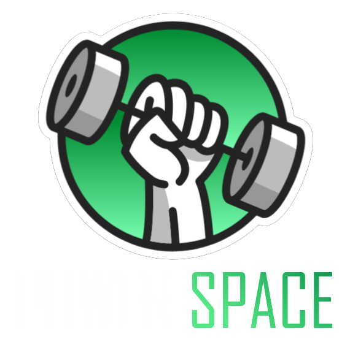

<p align="center">
  
</p>

# Power Space - React project
Power Space jest platformą społecznościową dla trójboistów, przy pomocy której możemy aktualizować swoje wyniki siłowe. Wszyscy użytkownicy aplikacji są punktowani i stawiani obok siebie w rankingu. Dodatkowo możemy publikować posty wraz ze zdjęciami na wallu oraz dodawać innych użytkowników do listy znajomych. Stworzyłem ten projekt aby nauczyć się pracy przy użyciu reacta oraz innych bibliotek niezbędnych do tworzenia wydajnego, utrzymywalnego kodu o wysokiej jakości.

# [Live DEMO](https://power-space.vercel.app)

| Project preview           |
:-------------------------:
||
<br>
<br>

## Tech stack
The application was developed by using these tools:
- React,
- Vite,
- TailwindCSS,
- Tanstack Query,
- React-Hook-Form,
- React Hot Toast,
- Vitest,
- Testing Library,
- Supabase
  <br>
  <br>
## Getting Started
Follow these steps to install power-space on your local environment.
<br>
<strong>Install the packages</strong>
```
npm install
```

<strong>Run the app using terminal</strong>
```
npm run dev
```
<br>
<br>

# Requirements
<br>

## General:
- Build a real world application from the scratch.
- Use best practices to provide good performance, scalability and readability of the project.
- Create responsive UI.

## Homepage:
- Print neccessary informations about the product such as pros of using the app, pricing, contact form etc.
- Allow user to smooth scroll through the page by using the navigation bar on the top of the screen.
- Create call to action buttons to navigate to log in or sign up page.<br>

## Authentication:

- Users of the app are people intrested in lifting weights, allow them to create an account or log in to an existing one.<br>
- Keep the session alive until user loggs out or clears cache memory.

## Wall:
- App needs a view on newest posts added by the community.
- Allow users to zoom in the images.
- Allow users to add their own posts with an option of uploading images.
- Users may want to edit their post or even delete it from the app.
- Display a descriptive icon if author of a posts is in a friends list of the currently logged in user.
- Instead of showing full content of a post, display only a piece of it with "show more" button at the end.<br>

## Dashboard:
- App needs a view on the currenly logged in user and his statistics such as lifting stats, age, height etc.
- Display an etiquette of an user with a color reffering to users score.
- Allow user to update his statistics and training parameters.<br>

## Ranking/Profiles:
- Create a table of users currently registered in the application.
- Allow users to filter through profiles by age. (juniors/seniors)
- Allow users to sort the table by score, total and weight.
- Create pagination or infinite loading to display only readable amount of profiles.
- Show adequate medal for top 3 lifters in each category.
- Display profile of each user of the app.
 <br>

 ## Friends:
- Users can add each other to friends list via button on the profile page.
- Display a list of profiles that user added to his friends list.
- In each of them user has to find a button to navigate to that profiles details.<br>
  
## Account:
- Allow users to change account data such as username and password.<br>
  
## Settings:
- Some users may want to use pounds instead of kilograms, allow them to change the unit.
- Create an option to hide a profile in a ranking leaderboard.<br>


## Back-end
## Problems
## Testing
## CI/CD
